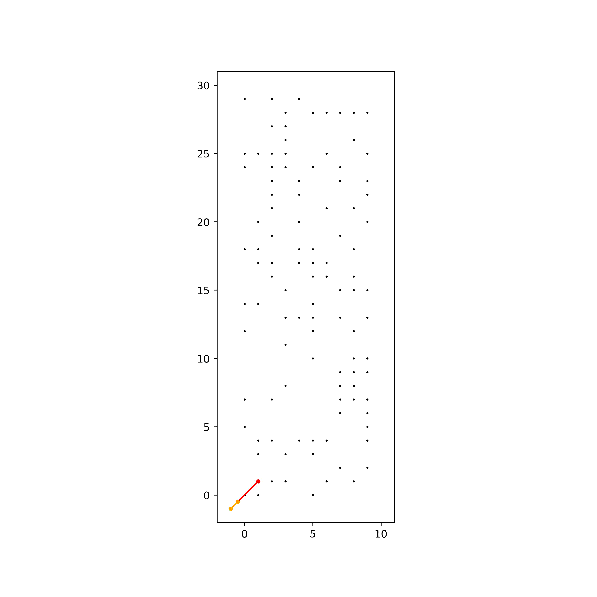
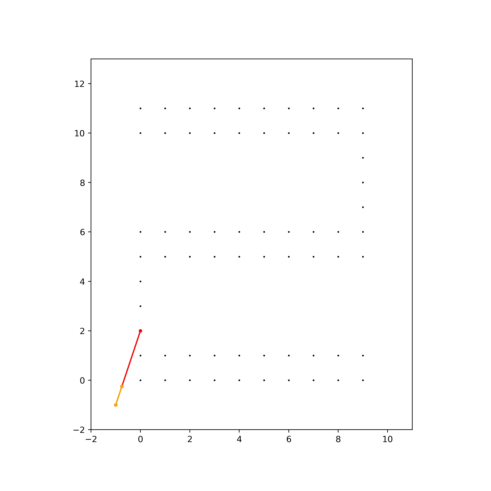

# CSE 202 Project Implementation: Rock Climbing
Jackob Getzel, Stewart Grant, Patrick Youssef
## Implementation Details

The code for our implementation was written in Python for it's convenience and flexibility. We did not utilize any libraries to directly solve this problem but instead some helper libraries for plotting and data structures. The machine running the code was a linux desktop running Ubuntu 20.04 with an Intel 10900k processor with 10 cores although we did not utilize more than one thread.

## Code Explanation

As the implementation for the project is quite long we will only be highlighting specific functions that we think are especially important to look at in regards to the implementation.

### Climber Methods

There are a few methods associated with working with the climber that we wanted to discuss.

1. `set_position`: Sets the climber position based on an 8-tuple
2. `occupies_position`: Determine whether the climber occupies a given hold
3. `valid`: Determines if a given climber configuration is valid based on limb reach

### Graph Instantiation

We never explicitly compute our graph as we quickly understood that the scale of the graph is quite large in this problem and instead spread the graph creation overhead across the traversal. Essentially, as we traverse instead of querying neighbors out of some data structure, we instead determine them at runtime.

### Climb Methodology

Generally speaking, the way we will traverse the graph is to execute the following:

1. Determine the set of next valid moves given a current configuration.
2. As we traverse this set of neighbors, determine if the climber can complete the climb by reaching to the top of the wall.
3. If they can complete, return the visited dictionary to reconstruct the path, otherwise keep climbing.
4. If we run out of moves, we return that the climb is not possible.

### BFS Climb

Our BFS implementation is pretty standard and works off our base climbing methodology.

```python
def BFS_climb(wall, climber):
    visited_dict = dict()
    base_tuple = (-1, -1, -1, -1, -1, -1, -1, -1)
    visited_dict[base_tuple]] = base_tuple

    print_wall_with_climber(wall, climber)

    # BFS climber
    queue = find_next_valid_moves(climber, wall, visited_dict)
    while len(queue) != 0:
        climber = queue.pop(0)
        if can_complete(climber, wall, visited_dict):
            # print_path(climber, wall, visited_dict)
            print("Found Exit")
            return visited_dict, climber
        queue.extend(find_next_valid_moves(climber, wall, visited_dict))
    print("BFS failed unable to find path to the top")
```

### DFS Climb

As you can see the code for the DFS climb is extremely similar to the BFS climb code, but this is to be expected. The primary difference between BFS and DFS is how the next traversal is decided. As mentioned prior, BFS completes equal depth traversals and then steps into the next depth whereas DFS only goes into depth until hitting an endpoint. This behavior is characteristic fo the queue vs stack in BFS and DFS respectively.

```python
def DFS_climb(wall, climber):
    visited_dict = dict()
    visited_dict[(-1, -1, -1, -1, -1, -1, -1, -1)
                 ] = (-1, -1, -1, -1, -1, -1, -1, -1)

    print_wall_with_climber(wall, climber)

    # DFS climber
    stack = find_next_valid_moves(climber, wall, visited_dict)
    while len(stack) != 0:
        climber = stack.pop(0)
        if can_complete(climber, wall, visited_dict):
            print_path(climber, wall, visited_dict)
            return
        stack = find_next_valid_moves(climber, wall, visited_dict) + stack
    print("DFS failed unable to find path to the top")
```

### Finding Next Moves

Both of our climb methodologies rely on determining the next moves of the climb, here we'll discuss how that's done in more detail. The below code is how we proceed with this.

```python
def find_next_valid_moves(climber, wall, visited):
    moves = []
    holds = find_candidate_holds(wall)
    for hold in holds:
        copy_climber = copy.copy(climber)
        for limb in copy_climber.Get_Limbs():
            # The climbing must not have a limb on the same hold
            if climber.occupies_position(hold):
                continue
            tmp = limb.position
            limb.position = hold

            if copy_climber.valid() and not has_visited(visited, copy_climber):
                # set the prior move, to the current location
                visited[copy_climber.pos_tuple()] = climber.pos_tuple()
                moves.append(copy.copy(copy_climber))

            limb.position = tmp
    return moves
```

Let's break down what's happening.
1. `find_candidate_holds` returns an ordering of the holds with a preference for higher holds.
2. For each hold, if it is valid for a limb of the climber to change to that hold we save that new configuration as a possible transition.
3. The list of these valid configurations is returned.

### Reconstructing Path

Given that we maintain a visited dictionary, it's trivial to backtrack from the end point to reconstruct the path. This is done with the following code.

```python
def get_path(visited, climber):
    # Rectify Path
    end = climber.pos_tuple()
    start = (-1, -1, -1, -1, -1, -1, -1, -1)

    path = [end]
    while True:
        end = visited[end]
        path.append(end)
        if end == start:
            break
    return path
```

With the reconstructed path, we can now visualize what the climb looks like!

## Example Climbs

We saw much better behavior with BFS in terms or number of moves and seemingly redundant moves so the examples here were all generated with BFS. All climbs were done for a climber of equal length limbs where L=2. In the visualization, each color is consistent for a given limb and the node connecting them is merely the centroid of the hold positions and the center of the climber is a fairly abstract concept given the flexibility of the limb reaches.

### Random Wall

Our favorite climb is the following where the holds were randomly generated with a given probability (in this case P=0.4 that a position contains a hold). 



### Zig Zag

Another interesting one is the zig-zag case where we can see very clearly where some of our assumptions fall apart for a real climber. In the middle of the climb the climber is completely sideways turning their legs and arms over and under. To be fair, we designed a very abstract climber that was not especially characteristic of a human but interesting to see how different it is nonetheless.

